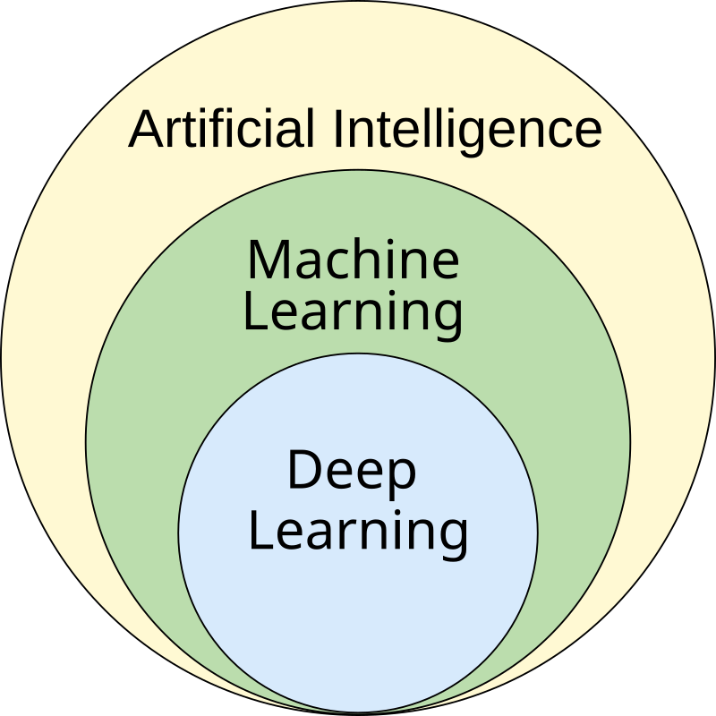

# Machine Learning
Machine Learning is a subset of AI that allows machines to learn from data and make predictions or decisions without being explicitly programmed. It inlcudes various algorithms that help to analyze and learn from patterns in input data and generalize to unseen data.  

ML finds application in many fields, including natural language processing, computer vision, speech recognition, email filtering, agriculture, and medicine. The application of ML to business problems is known as predictive analytics.

Statistics and mathematical optimization (mathematical programming) methods comprise the foundations of machine learning. Data mining is a related field of study, focusing on exploratory data analysis (EDA) via unsupervised learning.

From a theoretical viewpoint, **probably approximately correct (PAC)** learning provides a framework for describing machine learning. **PAC** is a framework for mathematical analysis of machine learning. In this framework, the learner receives samples and must select a generalization function (called the hypothesis) from a certain class of possible functions. The goal is that, with **high probability** (the "probably" part), the selected function will have low **generalization error** (the "approximately correct" part). The learner must be able to learn the concept given any arbitrary approximation ratio, probability of success, or distribution of the samples.

## Relation to other fields

  

Machine Learning is a sub-category of AI, and Deep Learning is a sub-category of ML, meaning they are both forms of AI. Artificial intelligence is the broad idea that machines can intelligently execute tasks by mimicking human behaviours and thought processes.

# Deep Learning
Deep learning is a subset of machine learning that focuses on utilizing neural networks to perform tasks such as classification, regression, and representation learning. The field takes inspiration from biological neuroscience and is centered around stacking artificial neurons into layers and "training" them to process data. The adjective "deep" refers to the use of multiple layers (ranging from three to several hundred or thousands) in the network. Methods used can be either supervised, semi-supervised or unsupervised.

Some common deep learning network architectures include fully connected networks, deep belief networks, recurrent neural networks, convolutional neural networks, generative adversarial networks, transformers, and neural radiance fields. These architectures have been applied to fields including computer vision, speech recognition, natural language processing, machine translation, bioinformatics, drug design, medical image analysis, climate science, material inspection and board game programs, where they have produced results comparable to and in some cases surpassing human expert performance.

# Machine Learning VS Deep Learning
| Machine Learning | Deep Learning|
|------------------|--------------|
|A subset of AI that focuses on learning from data to make predictions.| A subset of ML that uses deep neural networks for learning from large datasets|
|Alogrithms: Linear Regression, Decision Trees, Random Forests, SVM, etc.| Neural Networks, Convolutional Neural Networks (CNN), Recurrent Neural Networks (RNN), etc|
|ML works well with smaller datasets| DL requires large datasets to perform effectively|
| ML Algorithms can run on standard CPUs.|DL requires high computational power (typically GPUs)|
|Often requires manual feature extraction and selection.|Automatically learns features from raw data.|
|Easier to interpret, especially with simpler models.|Often considered a "black-box" model, harder to interpret.
|Good for simpler tasks and structured data.|Excellent for complex tasks (e.g., image and speech recognition).|
|Usecases: Predictive modeling, classification, regression with structured data.| Usecases: Image recognition, speech recognition, NLP, autonomous vehicles.|
